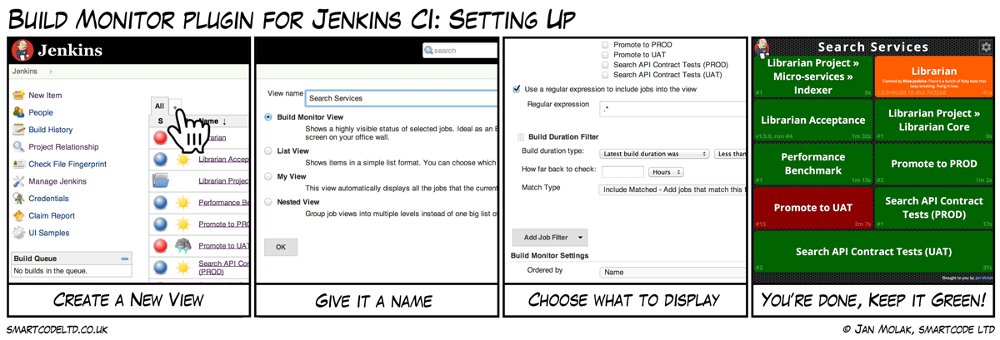
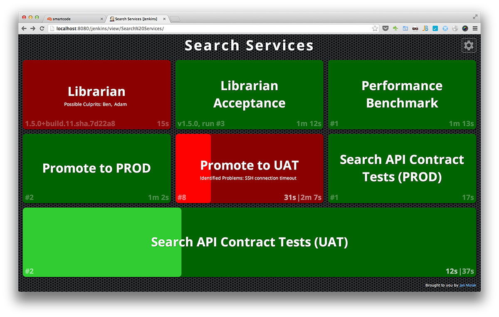
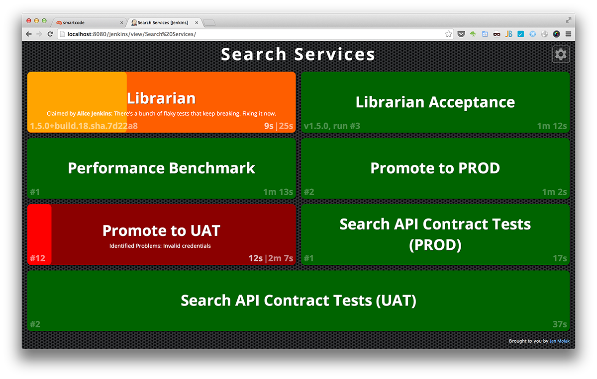
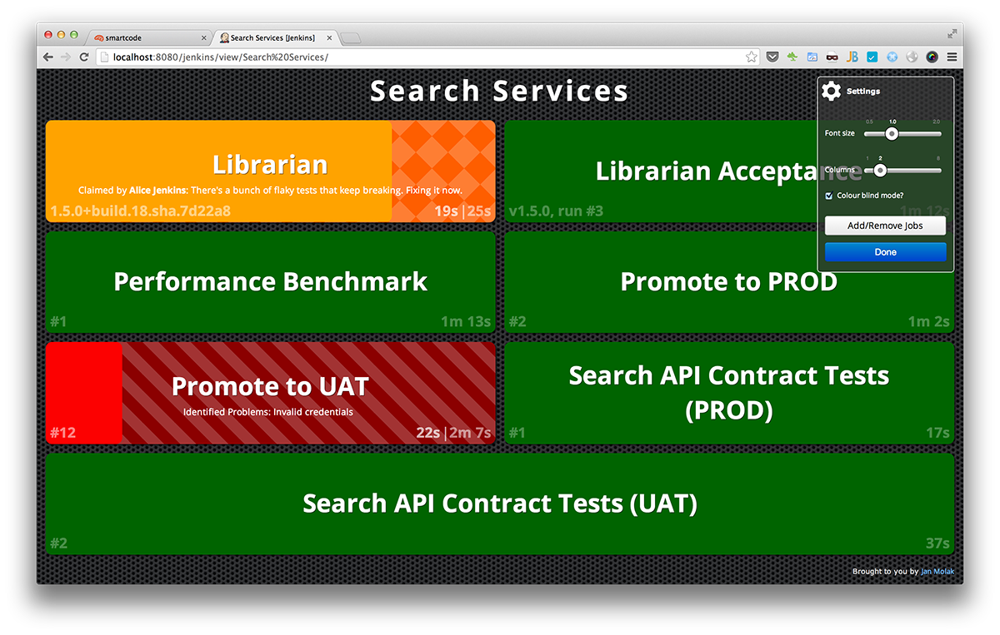

# Jenkins CI Build Monitor Plugin

Version that includes a change to add in a Run Tests Button in the dashboard and a link to go the Test Results straight away

Build Monitor Plugin provides a highly visible view of the status of selected Jenkins jobs.

It easily accommodates different computer screen sizes and is ideal as an Extreme Feedback Device to be displayed on a screen on your office wall.
(Inspired by the no longer maintained [RadiatorView](https://wiki.jenkins-ci.org/display/JENKINS/Radiator+View+Plugin) plugin).

Have a question? Perhaps it's already been answered - check the [FAQ](#faq) section below.

## Features

I'd like to keep the plugin as simple as possible, yet useful and effective.

Current functionality of the Build Monitor plugin:

* Displays the status and progress of selected jobs. The view is updated automatically every couple of seconds using AJAX, so no "Enable Auto Refresh" needed.
* Displays the names of people who might be responsible for "breaking the build".
* Supports the [Claim plugin](https://wiki.jenkins-ci.org/display/JENKINS/Claim+plugin), so that you can see who's fixing a broken build
* Supports [View Job Filters](https://wiki.jenkins-ci.org/display/JENKINS/View+Job+Filters), so that you can easily create Build Monitors for "slow builds", "only failing", etc.
* Supports [Build Failure Analyzer](https://wiki.jenkins-ci.org/display/JENKINS/Build+Failure+Analyzer), so that you know not only *who*, but also *what* broke the build; [learn more](http://bit.ly/JBMBuild102)
* Supports [CloudBees Folders Plugin](https://wiki.jenkins-ci.org/display/JENKINS/CloudBees+Folders+Plugin), so that you can have project- and team-specific nested Build Monitors; [learn more](http://bit.ly/JBMBuild117)
* Supports [Pipeline Plugin](https://wiki.jenkins-ci.org/display/JENKINS/Pipeline+Plugin), so that the currently executing stage(s) are shown.
* The number of columns and size of the font used is easily customisable, making it trivial to accommodate screens of different sizes.
* UI configuration is stored in a cookie, making it possible to display different number of columns and using different font size on each of the screens at your office.
* Can work in a colour-blind-friendly mode; [learn more](https://github.com/jan-molak/jenkins-build-monitor-plugin/issues/30#issuecomment-35849019)

All the previous releases together with their change logs are [listed here](https://bitly.com/JBMReleases).

## Requirements

To use Build Monitor you'll need:
* [Jenkins CI](http://jenkins-ci.org/) version 1.642.3 or newer - please note that for production installations I recommend using a [Long-Term Support release](http://jenkins-ci.org/changelog-stable)
* A modern web browser - to avoid unnecessary complexity when implementing the view layer I decided to use CSS 3 flexbox.
The standard is currently supported by [most modern web browsers](http://caniuse.com/flexbox), so if your browser doesn't support this feature - [consider upgrading](http://browsehappy.com/) :)

## Your feedback matters!

Do you find Build Monitor useful? Give it a star! &#9733;

Found a bug? Raise [an issue](https://github.com/jan-molak/jenkins-build-monitor-plugin/issues?state=open)
or submit a pull request ([start with this mini-dev guide](https://github.com/jan-molak/jenkins-build-monitor-plugin/wiki/Development-Guide), it might come in handy).

Have feedback? Let me know on twitter: [@JanMolak](https://twitter.com/JanMolak)

## Setting up

Simple, right? :-) You can have as many Build Monitor Views as you want - the most popular approach is to have one per team or one per project.

# A picture is worth a thousand words

## Roadmap and work in progress

To stay up-to-date with the project news - [follow @JanMolak on twitter](https://twitter.com/JanMolak).

If you'd like to know what's coming next - have a look at the project's [kanban board](https://waffle.io/jan-molak/jenkins-build-monitor-plugin).
Here's how the columns work:

* Ideas - ideas up for discussion. If you'd like to see any of them making it into the Build Monitor project - vote on them or submit a pull request.
* Backlog - features most wanted by the Build Monitor Community. I'll get them done as soon as I have a spare moment. Feel free to help out! :-)
* In progress - stuff I'm currently working on and will make it into the next release.
* Done - done and deployed. Grab the latest version from your Jenkins Update Centre or the [Releases](https://bitly.com/JBMReleases) page.

If you'd like to get hold of the latest and greatest build of the Build Monitor Plugin
before it's available in the Jenkins Update Centre, you can [download it](https://smartcode-opensource.ci.cloudbees.com/job/build-monitor/lastBuild/) from the [SmartCode Open-Source](http://bit.ly/SmartCodeOSCI) Jenkins CI server.

## (A)TDD

If you'd like to understand more about the logic behind the Build Monitor Plugin,
have a look at the [tests that drove the design](/build-monitor-plugin/src/test/java/com/smartcodeltd/jenkinsci/plugins).

## FAQ

### How do I let my teammates know that I'm fixing a broken build?

By claiming it. Build Monitor supports Jenkins [Claim Plugin](https://wiki.jenkins-ci.org/display/JENKINS/Claim+plugin), so once you have it installed, enable "Broken build claiming" in the "Post-build actions" of your Jenkins job. From now on you'll be able to claim any further broken builds and Build Monitor will pick it up.

You might also be interested in a [script](https://wiki.jenkins-ci.org/display/JENKINS/Allow+broken+build+claiming+on+every+jobs) that enables claiming on all your Jenkins jobs.

### How do I know what broke the build?

Wouldn't it be great to know _what_ made your build fail? Well of course it would. Build Monitor supports Jenkins [Build Failure Analyzer Plugin](https://wiki.jenkins-ci.org/display/JENKINS/Build+Failure+Analyzer) so get it, [teach it](https://wiki.jenkins-ci.org/display/JENKINS/Build+Failure+Analyzer#BuildFailureAnalyzer-Knowledgebase) and Build Monitor will tell you what the Failure Analyzer found out.

### I have too many jobs on one screen, what should I do?

You have several options here:

1. **review the granularity of your jobs**: If you have too many low-level jobs displayed on one screen, consider consolidating them using [Promoted Builds Plugin](https://wiki.jenkins-ci.org/display/JENKINS/Promoted+Builds+Plugin) or [MultiJob Plugin](https://wiki.jenkins-ci.org/display/JENKINS/Multijob+Plugin)
1. **use job filters**: Build Monitor supports Jenkins [View Job Filters Plugin](https://wiki.jenkins-ci.org/display/JENKINS/View+Job+Filters), if you have it installed
1. get a bigger screen ...

### Red and green colours are lovely, but I'm colour blind ...
There's a colour blind mode you can [enable in the Settings](https://github.com/jan-molak/jenkins-build-monitor-plugin/issues/30#issuecomment-35849019)

## Open Source Software Used

* [Angular.js](http://angularjs.org/)
* [Angular-slider](http://prajwalkman.github.io/angular-slider/)
* Customised [Angular Bootstrap](http://angular-ui.github.io/bootstrap/)
* [HTML5 Boilerplate](http://html5boilerplate.com/) normalize.css
* [OpenSans font](http://www.google.com/fonts/specimen/Open+Sans) by Steve Matteson

## Friends of Build Monitor

Build Monitor is continuously delivered to a Jenkins near you thanks to:
* the time and commitment of [the author](http://smartcodeltd.co.uk/) and [the contributors](https://github.com/jan-molak/jenkins-build-monitor-plugin/graphs/contributors)
* a battery of browsers provided by [BrowserStack](https://www.browserstack.com) and powering the [acceptance tests](/build-monitor-acceptance/src/test/java)

